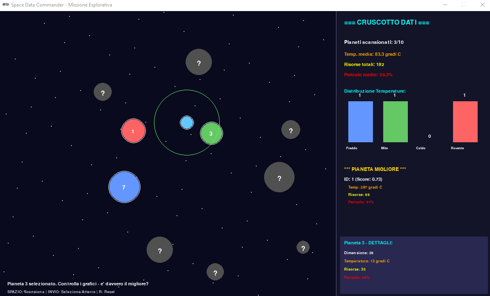

# 🚀 Space Data Commander

Un gioco educativo interattivo per imparare l'analisi dati con **Polars** e Python mentre esplori lo spazio!


## 📖 Descrizione

**Space Data Commander** è un gioco educativo che combina programmazione, analisi dati e divertimento. Nei panni di un comandante spaziale, dovrai esplorare 10 pianeti, raccogliere dati scientifici e utilizzare le tue competenze in analisi dati per identificare il pianeta perfetto dove fondare una colonia.

### 🎯 Obiettivi Didattici

- Imparare ad usare **Polars**, una libreria moderna e veloce per l'analisi dati
- Comprendere operazioni su DataFrame (lettura/scrittura CSV, aggregazioni, sorting)
- Visualizzare dati in tempo reale
- Applicare logica di scoring e ranking
- Lavorare con strutture dati (dizionari e liste)

## ✨ Caratteristiche

- **10 pianeti proceduralmente generati** con caratteristiche uniche
- **Sistema di scansione** per raccogliere dati planetari
- **Dashboard dati in tempo reale** con statistiche e grafici
- **Analisi con Polars** per calcolare il pianeta migliore
- **Visualizzazione distribuzione temperature** con grafici a barre
- **Salvataggio persistente** dei dati in formato CSV

## 🎮 Come Giocare

### Comandi

| Tasto | Azione |
|-------|--------|
| `←→↑↓` | Muovi l'astronave |
| `SPAZIO` | Scansiona il pianeta vicino |
| `INVIO` | Seleziona/Atterra sul pianeta |
| `R` | Reset missione |

### Obiettivo

1. **Esplora** lo spazio muovendoti con le frecce
2. **Scansiona** tutti i 10 pianeti avvicinandoti e premendo SPAZIO
3. **Analizza** i dati nel pannello laterale
4. **Identifica** il pianeta migliore (alta temperatura, molte risorse, basso pericolo)
5. **Atterra** sul pianeta migliore premendo INVIO per completare la missione!

## 🛠️ Installazione

### Prerequisiti

- Python 3.8 o superiore
- pip (gestore pacchetti Python)

### Installazione Dipendenze

```bash
# Installa le dipendenze
pip install pgzero polars
```

### Avvio del Gioco

```bash
python space_data_commander.py
```

## 📊 Cosa Imparerai su Polars

Il gioco implementa diverse operazioni tipiche dell'analisi dati:

### 1. Creazione e Scrittura DataFrame
```python
new_row = pl.DataFrame({
    "planet_id": [planet_dict["id"]],
    "temperature": [planet_dict["temperature"]],
    "resources": [planet_dict["resources"]],
    "danger": [planet_dict["danger"]],
})
df.write_csv(CSV_FILE)
```

### 2. Lettura e Concatenazione
```python
df = pl.read_csv(CSV_FILE)
df = pl.concat([df, new_row])
```

### 3. Aggregazioni
```python
stats = {
    "avg_temp": df["temperature"].mean(),
    "total_resources": df["resources"].sum(),
    "avg_danger": df["danger"].mean(),
}
```

### 4. Calcolo Colonne Derivate
```python
df_scored = df.with_columns([
    ((pl.col("temperature") / 300) * 0.3 +
     (pl.col("resources") / 100) * 0.5 +
     (1 - pl.col("danger") / 100) * 0.2).alias("score")
])
```

### 5. Sorting e Ranking
```python
best = df_scored.sort("score", descending=True).head(1)
```

## 📁 Struttura del Progetto

```
game12/
│
├── space_data_commander.py   # File principale del gioco
├── planets_data.csv           # Dati raccolti (generato automaticamente)
└── README.md                  # Questo file
```

## 🎨 Screenshot



## 🔧 Dettagli Tecnici

### Attributi dei Pianeti

Ogni pianeta ha le seguenti caratteristiche:

- **ID**: Identificatore univoco (1-10)
- **Temperatura**: Da -100°C a 300°C
- **Risorse**: Quantità da 0 a 100
- **Pericolo**: Livello da 0% a 100%
- **Dimensione**: Raggio visivo del pianeta

### Formula di Scoring

Il pianeta migliore viene calcolato con questa formula ponderata:

```
Score = (Temperatura/300 × 0.3) + (Risorse/100 × 0.5) + ((100-Pericolo)/100 × 0.2)
```

- 30% peso sulla temperatura
- 50% peso sulle risorse
- 20% peso sulla sicurezza (inverso del pericolo)

## 🤝 Contribuire

I contributi sono benvenuti! Ecco come puoi aiutare:

1. Fork il progetto
2. Crea un branch per la tua feature (`git checkout -b feature/NuovaFunzionalita`)
3. Commit le modifiche (`git commit -m 'Aggiunge NuovaFunzionalita'`)
4. Push al branch (`git push origin feature/NuovaFunzionalita`)
5. Apri una Pull Request

### Idee per Miglioramenti

- [ ] Aggiungere più tipologie di pianeti (gassosi, rocciosi, etc.)
- [ ] Implementare grafici più complessi (scatter plot, heatmap)
- [ ] Aggiungere sistema di inventario carburante
- [ ] Modalità multiplayer
- [ ] Export report PDF della missione
- [ ] Integrazione con altre librerie (Matplotlib, Plotly)

## 📚 Risorse Didattiche

### Polars
- [Documentazione ufficiale Polars](https://pola-rs.github.io/polars/)
- [Polars User Guide](https://pola-rs.github.io/polars-book/)

### Pygame Zero
- [Documentazione Pygame Zero](https://pygame-zero.readthedocs.io/)
- [Tutorial Pygame Zero](https://pygame-zero.readthedocs.io/en/stable/introduction.html)

## 📝 Licenza

Questo progetto è rilasciato sotto licenza MIT. Vedi il file `LICENSE` per maggiori dettagli.

## 👨‍💻 Autore

Creato con ❤️ da Python Biella Group per studenti che vogliono imparare l'analisi dati in modo divertente!

## 🙏 Ringraziamenti

- **Polars** per aver creato una libreria di analisi dati incredibilmente veloce
- **Pygame Zero** per rendere la programmazione di giochi accessibile
- Tutti gli studenti e insegnanti che useranno questo gioco per imparare!

---

⭐ Se questo progetto ti è stato utile, lascia una stella su GitHub!

🐛 Hai trovato un bug? Apri una issue...