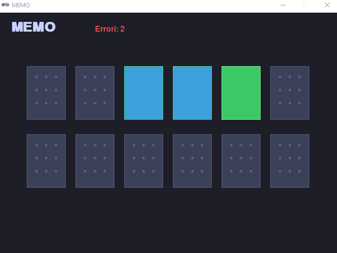

# 🃏 MEMO

Un classico gioco di memoria realizzato con **Python** e **Pygame Zero**, pensato per imparare a programmare giochi in modo semplice e divertente.

Parte del progetto [LearningPythonWithGames](https://github.com/PythonBiellaGroup/LearningPythonWithGames) di **Python Biella Group**.

---

## 🎮 Come si gioca

- Sul tavolo sono disposte **12 carte coperte** (6 coppie di colori).
- Ogni turno, clicca su **due carte** per scoprirle.
- Se i colori **coincidono** → la coppia resta visibile ✅
- Se i colori **non coincidono** → le carte si rigirano dopo 2 secondi ❌
- L'obiettivo è trovare tutte e 6 le coppie **nel minor numero di errori possibile**.
- A partita completata, premi **SPAZIO** per ricominciare.

---

## 🖥️ Screenshot



---

## 🚀 Installazione e avvio

### Prerequisiti

- Python 3.8 o superiore
- `pgzero` (Pygame Zero)

### Installazione dipendenze

```bash
pip install pgzero
```

### Avvio del gioco

```bash
python memo.py
```

> ⚠️ Pygame Zero richiede che lo script venga avviato direttamente con `python`, non con `pgzrun` da riga di comando.

---

## 📁 Struttura del progetto

```
memo.py        # File principale del gioco (tutto in un unico file)
README.md      # Questo file
```

---

## 🧠 Concetti Python trattati

Questo progetto è pensato a scopo **didattico**. Analizzando il codice si incontrano:

| Concetto | Dove |
|---|---|
| Variabili e costanti | Configurazione layout e colori |
| Liste e indicizzazione | Gestione delle carte (`carte[idx]`) |
| Funzioni | `crea_carte()`, `disegna_carta()`, `nascondi_carte()` |
| Cicli `for` | Iterazione sulle carte da disegnare |
| Condizioni `if/else` | Logica di gioco (coppia corretta o no) |
| Stato globale | Variabili `errori`, `selezionate`, `partita_vinta` |
| Callback e timer | `clock.schedule()` di Pygame Zero |
| Shuffle casuale | `random.shuffle()` per rimescolare le carte |
| Programmazione a eventi | `on_mouse_down()`, `on_key_down()` |

---

## ⚙️ Personalizzazione

Puoi modificare facilmente il comportamento del gioco cambiando le costanti in cima al file:

```python
COLONNE        = 6     # Numero di colonne della griglia
DURATA_MOSTRA  = 2     # Secondi prima di rigirare le carte sbagliate
CARTA_W        = 80    # Larghezza di ogni carta (pixel)
CARTA_H        = 110   # Altezza di ogni carta (pixel)
```

Per aggiungere nuove coppie, aggiungi colori alla lista `COLORI` e aumenta `COLONNE` o il numero di righe di conseguenza.

---

## 📚 Risorse utili

- [Pygame Zero — documentazione ufficiale](https://pygame-zero.readthedocs.io/)
- [Python Biella Group](https://pythonbiellagroup.it/)
- [Repository LearningPythonWithGames](https://github.com/PythonBiellaGroup/LearningPythonWithGames)

---

## 🤝 Contribuire

Hai idee per migliorare il gioco o vuoi aggiungere una variante? Apri una **issue** o una **pull request** sulla repo principale!

---

## 📄 Licenza

Distribuito sotto licenza **MIT**. Vedi il file `LICENSE` nella repository principale per i dettagli.
