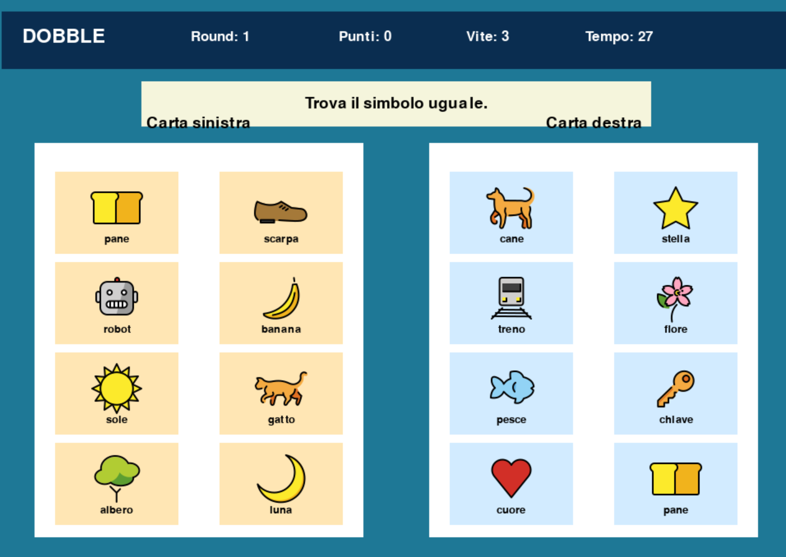

# 🔵 Dobble

Una versione digitale ispirata al celebre gioco di carte **Dobble**, realizzata con **Python** e **Pygame Zero**, pensata per imparare a programmare giochi in modo semplice e divertente.

Parte del progetto [LearningPythonWithGames](https://github.com/PythonBiellaGroup/LearningPythonWithGames) di **Python Biella Group**.

---

## 🎮 Come si gioca

- Vengono mostrate **due carte** affiancate, ciascuna con 8 simboli.
- Tra le due carte esiste sempre **esattamente un simbolo uguale**.
- Clicca il prima possibile sul simbolo in comune per guadagnare un punto ✅
- Se clicchi il simbolo sbagliato perdi una vita ❌
- Se il tempo scade (30 secondi) perdi una vita ❌
- Raggiungi **8 punti** prima di esaurire le **3 vite** per vincere!

---

## 🖥️ Screenshot



---

## 🚀 Installazione e avvio

### Prerequisiti

- Python 3.8 o superiore
- `pgzero` (Pygame Zero)

### Installazione dipendenze

```bash
pip install pgzero
```

### Struttura immagini richiesta

Il gioco carica le immagini dei simboli da una cartella `images/` nella stessa directory dello script. Ogni simbolo deve avere un file PNG con il nome corrispondente (es. `sole.png`, `luna.png`, ecc.).

I simboli attualmente supportati sono:

```
sole, gatto, albero, luna, cane, stella, treno, fiore,
pesce, chiave, cuore, libro, nuvola, mela, razzo,
occhio, pane, scarpa, robot, banana
```

### Avvio del gioco

```bash
python dobble.py
```

---

## 📁 Struttura del progetto

```
dobble.py        # File principale del gioco
images/          # Cartella con le immagini dei simboli (PNG)
  sole.png
  luna.png
  ...
README.md        # Questo file
```

---

## 🧠 Concetti Python trattati

Questo progetto è pensato a scopo **didattico**. Analizzando il codice si incontrano:

| Concetto | Dove |
|---|---|
| Variabili e costanti | Configurazione vite, tempo, punteggio obiettivo |
| Liste | `simboli_sinistra`, `simboli_destra`, `box_carta_sinistra` |
| Stringhe e `split()` | Parsing dei round dal formato testo (`";"` e `"|"`) |
| Funzioni | `avvia_partita()`, `carica_round()`, `controlla_risposta()` |
| Stato della macchina | Variabile `stato_gioco` (`"menu"`, `"gioco"`, `"vittoria"`, `"game_over"`) |
| Cicli `for` con indice | Iterazione su box e simboli in `disegna_carta()` |
| Condizioni `if/elif/else` | Logica risposta corretta/sbagliata/tempo scaduto |
| Callback a evento | `on_mouse_down()` per intercettare i clic |
| Timer periodico | `clock.schedule_interval()` per il conto alla rovescia |
| Shuffle casuale | `random.shuffle()` per mescolare i round |
| Rendering condizionale | `draw()` smista il disegno in base allo stato di gioco |

---

## ⚙️ Personalizzazione

Le costanti in cima al file permettono di modificare facilmente la difficoltà:

```python
TEMPO_ROUND         = 30   # Secondi disponibili per ogni round
PUNTEGGIO_OBIETTIVO = 8    # Punti necessari per vincere
VITE_INIZIALI       = 3    # Numero di vite iniziali
```

Per aggiungere nuovi round, aggiungi righe alla lista `rounds_raw` seguendo il formato:

```
"simbolo1;simbolo2;...;simbolo8|simbolo1;simbolo2;...;simbolo8|simbolo_comune"
```

Ricorda che il simbolo comune deve comparire esattamente una volta in ciascuna delle due carte.

---

## 📚 Risorse utili

- [Pygame Zero — documentazione ufficiale](https://pygame-zero.readthedocs.io/)
- [Python Biella Group](https://pythonbiellagroup.it/)
- [Repository LearningPythonWithGames](https://github.com/PythonBiellaGroup/LearningPythonWithGames)

---

## 🤝 Contribuire

Hai idee per migliorare il gioco o vuoi aggiungere nuovi simboli e round? Apri una **issue** o una **pull request** sulla repo principale!

---

## 📄 Licenza

Distribuito sotto licenza **MIT**. Vedi il file `LICENSE` nella repository principale per i dettagli.
